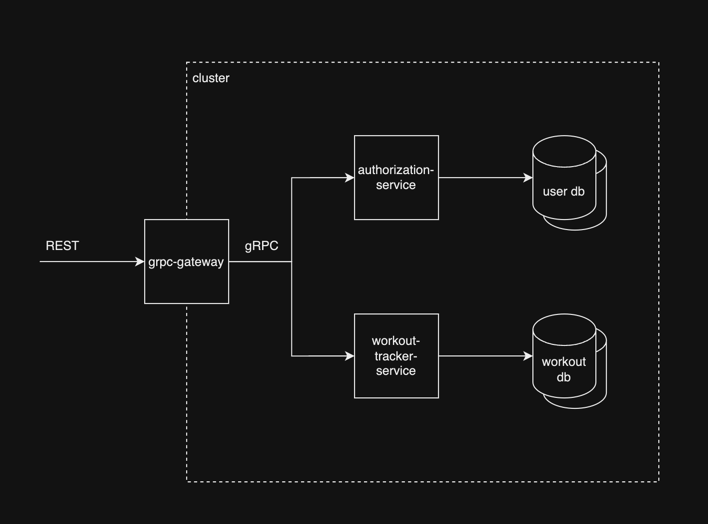

= workout-tracker
:toc:
:toclevels: 4

'''

*Workout tracker REST <--> gRPC implementation based on project idea from roadmap.sh*

https://roadmap.sh/projects/fitness-workout-tracker

'''
== System Design

=== Functional Requirements

You are required to develop an API for a workout tracker application that allows users to manage their workouts and track their progress.

*Expose API for register/login:*

- Allow users to create an account, passwords are stored securely (bcrypt selected)
- Allow users to log in to their account, after successful login JWT token is issued (signed with symmetric key for simplicity)

*Expose API for workout management:*

_All require access token obtained through login flow._

- Allow users to create workouts composed of multiple exercises
- Allow users to update workouts and add comments
- Allow users to delete workouts
- Allow users to schedule workouts for specific dates and times
- List active or pending workouts sorted by date and time
- Generate reports on past workouts and progress

*Additional:*

- Allow users to list system predefined exercises, no access control required here

=== Non-functional Requirements

- high performance and latency are critical, internal communication is using gRPC protocol
- REST API, reverse proxy (grpc-gateway) is put in front of all services to provide translation layer
- cloud native app, horizontally scalable, deployed to container orchestration system
- load balanced implied by above, using gRPC client side load balancing with kubernetes headless service
- encryption in transit not required -higher consistency levels not required, prefer availability and latency over consistency (PACELC theorem)
- high availability is required, all writes should be replicated to at least one additional instance, replica can be used to serve reads, high consistency not required but replication should be synchronous to prevent data loss

=== Architecture Diagram

=== External API

*authorization-service*

[source]
----
POST /v1/auth/register
----

.Request
[%collapsible]
=====
[source,json]
----
{
  "username": "ghost@gmail.com",
  "password": "qwerty"
}
----
=====

.Response
[%collapsible]
=====
[source,json]
----
{
  "userId": "5b7557db-f7a2-4abf-a92a-bd79881164f6"
}
----
=====

[source]
----
POST /v1/auth/login
----

.Request
[%collapsible]
=====
[source,json]
----
{
  "username": "ghost@gmail.com",
  "password": "qwerty"
}
----
=====

.Response
[%collapsible]
=====
[source,json]
----
{
  "token": "eyJhbGciOiJIUzI1NiIsInR5cCI6IkpXVCJ9.eyJ1c2VyX2lkIjoiNjEwZjQwZjAtMjUwZi00ZjQwLWEwZjYtZmQ0MGYwZjQwZjA0IiwiaWF0IjoxNjI5MjIwNjQyLCJleHAiOjE2MjkzMDcxNDJ9"
}
----
=====

*workout-tracker-service*

[source]
----
GET /v1/exercises?muscle_group_filter={muscle_group}&category_filter={category}
----

.Response
[%collapsible]
=====
[source,json]
----
{
  "exercises": [
    {
      "id": "94b4109b-25ba-4519-8aa7-6adef75c0d37",
      "name": "Bench Press",
      "muscle_group": "CHEST",
      "category": "strength"
    }
  ]
}
----
=====

[source]
----
POST /v1/workouts
Authorization: Bearer <token>
----

.Request
[%collapsible]
=====
[source,json]
----
{
  "name": "Back Day",
  "comment": "Do it as fast as you can",
  "exercises": [
    {
      "exercise_id": "94b4109b-25ba-4519-8aa7-6adef75c0d37",
      "order": 1,
      "repetitions": 10,
      "sets": 3,
      "weight": 50,
      "comment": "Do it slowly"
    }
  ]
}
----
=====

.Response
[%collapsible]
=====
[source,json]
----
{
  "id": "5b7557db-f7a2-4abf-a92a-bd79881164f6"
}
----
=====

[source]
----
GET /v1/workouts
Authorization: Bearer <token>
----

.Response
[%collapsible]
=====
[source,json]
----
{
  "workouts": [
    {
      "id": "5b7557db-f7a2-4abf-a92a-bd79881164f6",
      "name": "Back Day",
      "comment": "Do it as fast as you can"
    },
    {
      "id": "5b7557db-f7a2-4abf-a92a-bd79881164f6",
      "name": "Leg Day"
    }
  ]
}
----
=====

[source]
----
GET /v1/workouts/{workout_id}
Authorization: Bearer <token>
----

.Response
[%collapsible]
=====
[source,json]
----
{
  "id": "5b7557db-f7a2-4abf-a92a-bd79881164f6",
  "name": "Back Day",
  "comment": "Do it as fast as you can",
  "exercises": [
    {
      "exercise_id": "94b4109b-25ba-4519-8aa7-6adef75c0d37",
      "order": 1,
      "repetitions": 10,
      "sets": 3,
      "weight": 50,
      "comment": "Do it slowly"
    }
  ]
}
----
=====

[source]
----
PATCH /v1/workouts/{workout_id}
Authorization: Bearer <token>
----

.Request
[%collapsible]
=====
[source,json]
----
{
  "name": "Leg or Back Day",
  "comment": "Morning workout 22",
  "exercises": [
    {
      "exercise_id": "94b4109b-25ba-4519-8aa7-6adef75c0d37",
      "order": 2,
      "repetitions": 11,
      "sets": 5,
      "comment": "New exercise"
    },
    {
      "exercise_id": "94b4109b-25ba-4519-8aa7-6adef75c0d37",
      "order": 2,
      "repetitions": 11,
      "sets": 5,
      "comment": "Update existing"
    }
  ]
}
----
=====

.Response
[%collapsible]
=====
[source,json]
----
{}
----
=====

[source]
----
DELETE /v1/workouts/{workout_id}
Authorization: Bearer <token>
----

.Response
[%collapsible]
=====
[source,json]
----
{}
----
=====

>TODO - add scheduling and report generation API<

=== Internal API

*authorization-service*

https://github.com/mskalbania/workout-tracker/blob/main/proto/auth/v1/auth.proto[auth.proto]

*workout-tracker-service*

https://github.com/mskalbania/workout-tracker/blob/main/proto/workout/v1/workout.proto[workout.proto]

== Implementation

=== Stack & Tools

- grpc-gateway as reverse proxy to expose gRPC services as REST
* project link https://github.com/grpc-ecosystem/grpc-gateway
* grpc-gateway entry point https://github.com/mskalbania/workout-tracker/blob/main/grpc-gateway/main.go[grpc-gateway/main.go]
* grpc-gateway proto annotations https://github.com/mskalbania/workout-tracker/blob/main/proto/workout/v1/workout.proto[workout.proto]

>TODO<

=== Setup

==== Local Stack

Docker compose file is provided to spin up services and dependencies.
Run below command to start services - https://github.com/mskalbania/workout-tracker/blob/main/docker-compose.yaml[docker-compose.yaml]

- grpc-gateway
- single postgres instance
- authorization server
- workout tracker server

After stack is ready, request collection can be used from here https://github.com/mskalbania/workout-tracker/blob/main/requests.http[requests.http].
It contains (JetBrains HTTP client) REST API collection to interact with application.

Alternatively, happy path E2E test can be found here https://github.com/mskalbania/workout-tracker/tree/main/e2e/e2e.http[e2e.http].

==== Tests

To run tests locally, below steps are required:

1. run `mockery --all --with-expecter` inside selected app directory _(authorization-server | workout-tracker-server)_ to generate mock files, this requires installing 3rd party tool mockery `brew install mockery`
2. run `protoc-all.sh` in root dir to generate all proto code

== More Ideas or TODOs

* Add API tests for workout
* Implement scheduling and report generation requirement

* Add refresh tokens - currently re-login is required after access token expiry.
* Switch to always online validation of JWT tokens and keep offline as fallback to invalidate JWT tokens on logout, currently logout = remove token from device cache.
Since project is gRPC latency tradeoff could be acceptable.